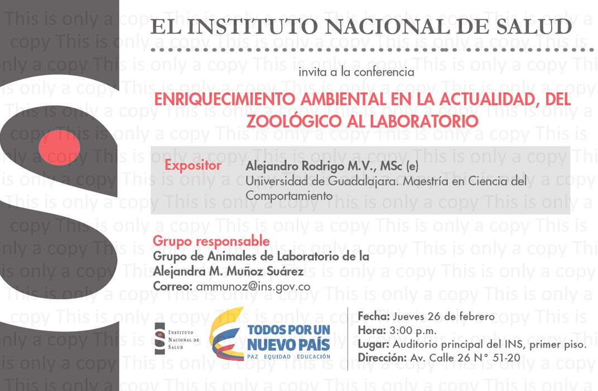

```{r, echo=FALSE, message=FALSE, warning=FALSE, include =FALSE}
library(knitr)    # For knitting document and include_graphics function
library(ggplot2)  # For plotting
library(png) 
library(data.table)
library(kableExtra)
library(tidyverse)
# library(ggstatsplot)
```

<!-- In this section, you will find almost all of the oral or poster presentations in which I have participated throughout my academic career. 

To see the oral presentations, click on the title. 
The posters are included in the text so you can download them if neccessary. 
If you click on the name of the conference, you will access either the program of the conference or a certificate of assistance. 
Click on the name on the institution to access their websites.  -->

`r emo::ji("warning")` The titles of the talks marked with the superscript _^a^_ were given in Spanish. For communication purposes, I changed the information to English. `r emo::ji("warning")` 

# Invited lectures

**Rodrigo, A.** (May 2022) [The role of behavioral ecology in conservation](){target="_blank"}. [Cycle of Conferences for the Dissemination of Science of the Academy of Processes and Dynamics in Psychology](docs/Files/Presentations/Rodrigo_CUCS2022_Constancia.png){target="_blank"}.
[Center for Health Sciences]()<!--add web-->{target="_blank"}, University of Guadalajara – Guadalajara, Jalisco (Mexico).

**Rodrigo, A.**, Avila-Chauvet, L., Moreno-Zazueta, J., & Ojeda, Y. (Nov 2017). “Prototype phase I – “Walden modular equipment”. Reto Zapopan. (Jalisco, Mexico).^a^<!--add some photo-->

**Rodrigo, A.** (Feb 2015). [Environmental enrichment nowadays, from the zoo to the laboratory](docs/Files/Presentations/Rodrigo_INS_Presentacion.html){target="_blank"}. [National Institute of Health](){target="_blank"}<!--add-->. (Bogotá, Colombia).^a^ 

{width=75%}

**Rodrigo, A.** (Jan 2015). [Environmental enrichment and its effects on behavior](){target="_blank"}. [Metropolitan Autonomous University campus Iztapalapa]()<!--add-->{target="_blank"} (Mexico City, Mexico).^a^<!--ready-->

{width=75%}<!--add-->

**Rodrigo, A.** (Mar 2012). Ambassador animal program to promote zoo education. Conferences on Medicine and Wildlife Management. [Autonomous Metropolitan University campus Xochimilco]()<!--add-->{target="_blank"}. (Mexico City, Mexico).^a^<!--add some photos-->

**Rodrigo, A.** (Mar 2012). Managing the volunteer program at the zoo. Conferences on medicine and wildlife management. [Autonomous Metropolitan University campus Xochimilco]()<!--add-->{target="_blank"}. (Mexico City, Mexico).^a^<!--add some photos-->

# Conference talks

**Rodrigo, A.**, & Fernández-Sordo, G. (Jul 2020). [Reversal of environmental conditions in adult Wistar rats]()<!--add-->{target="_blank"}. [2020 Virtual ABS Conference]()<!--add-->{target="_blank"}, [Animal Behavior Society](https://www.animalbehaviorsociety.org/web/index.php){target="_blank"}.<!--ready-->

{width=50%}

**Rodrigo, A.**, Longán, A., & Gómez-Medina, C. (Jul 2020). [Evaluation of Zoo Animal Training Programs]()<!--add-->{target="_blank"}. [2020 Virtual ABS Conference]()<!--add-->{target="_blank"}, [Animal Behavior Society](https://www.animalbehaviorsociety.org/web/index.php){target="_blank"}<!--ready-->

<!--add-->{width=50%}

**Rodrigo, A.**, Fernandez, G., Torres, C. (2015). [Effect of Environmental Enrichment in different periods of development]()<!--add-->{target="_blank"}. [XXV Mexican Congress of Behavior Analysis]()<!--add-->{target="_blank"}. (Xalapa, México).^a^<!--ready-->

```{r, echo=FALSE, out.width='100%', out.height='1000px' }
# knitr::include_graphics("Images/PIPO2/d.pdf")
```

**Rodrigo, A.**, Rico, J., Moreno, L. & Cardona, A. (2015). [Effect of Environmental Enrichment on the performance of rats in a reinforcement schedule IF60s](Images\Congresos\smac-xxv\f.mp4){target="_blank"}. [XXV Mexican Congress of Behavior Analysis](Images\Congresos\smac-xxv\f1.pdf){target="_blank"}. (Xalapa, México).^a^<!--ready-->

{width=50%}

**Rodrigo, A.**, González, I., & Martínez, G. (Sep 2009). Environmental Enrichment in Asian Elephants (Elephas maximus). 1st International Theoretical and Practical Congress of Clinical and Behavioral Management in Zoo Animals. University Antonio Narino. (Bogotá, Colombia).^a^

**Rodrigo, A.** (Aug 2009). Environmental enrichment in green macaws (Ara militaris). XXVI Symposium on Wild Fauna. Faculty of Veterinary Medicine and Zootechnics. National Autonomous University of Mexico (Mexico City, Mexico).^a^

{width=50%}

# Poster presentations

**Rodrigo, A.**, Avila-Chauvet, L., Esparza, C., Moreno Zazueta, J.N., Ojeda, Y.(Aug 2021) [Walden Operant Fish Tank: Automated equipment to assess positive fish welfare](Images/Walden/WOFT.html){target="_blank"}. [54th International Congress of the International Society for Applied Ethology (ISAE)](http://www.isae2021.com/){target="_blank"}. <!--add presentation in the future -->

Harvie, H., **Rodrigo, A.**, & Kelly, D.M. (Mar 2020) [Pigeon’s reliance on Landmarks vs. Geometric Cues in Novel Environment](Images\Nopal\Nopal Poster.pdf){target="_blank"}. Researchpalooza 2020. University of Manitoba; Winnipeg, Canadá.

{width=50%}

```{r, echo=FALSE, out.width='100%', out.height='1000px' }
# knitr::include_graphics("Images/Nopal/Nopal Poster.pdf")
```

**Rodrigo, A.**, Molina, J., Hernández, V., Soto, J., Miramontes, C., & Buriticá, J. (Nov 2018). [Strategies to locate a goal through the use of landmarks in a virtual environment. First forum of basic psychological research](Images\Zack\C.pdf){target="_blank"}. [University Center for Health Sciences](https://www.cucs.udg.mx/){target="_blank"}, University of Guadalajara; Jalisco Mexico.^a^<!--add some reference-->

```{r, echo=FALSE, out.width='100%', out.height='1000px' }
# knitr::include_graphics("Images/Zack/C.pdf")
```

**Rodrigo, A.**, Corona, S., Estrada, A., & Buriticá, J. (Nov 2018). [Computation of multiple landmarks to locate reinforcement area in Wistar rats](Images\Zack\Ratas\A.pdf){target="_blank"}. First forum of basic psychological research. University Center for Health Sciences, University of Guadalajara; Jalisco Mexico.^a^<!--add some reference-->

{width=75%}  

```{r, echo=FALSE, out.width='100%', out.height='1000px' }
# knitr::include_graphics("Images/Zack/Ratas/A.pdf")
```

**Rodrigo, A.**, Eudave Patiño, M., Serna, N., Lara, E., Avila-Chauvet, L., & Buriticá, J. (Oct 2018). [Time patterns of foraging behavior in Great-tailed grackle (Quiscallus mexicanus) at an urban patch](Images/Grackles/3.pdf){target="_blank"}. [XIX Biennial Meeting of the International Society for Comparative Psychology](Images/Grackles/2.pdf){target="_blank"}. [University of California Los Angeles](https://www.ucla.edu/){target="_blank"}, Los Angeles, USA.

Poster presented at the [International Society for Comparative Psychology](http://www.comparativepsychology.org/){target="_blank"} in 2018

```{r, include=TRUE, out.width='100%', out.height='1000px' }
# knitr::include_graphics("docs/Files/Presentations/Rodrigo_ISCP2018.pdf")
```

**Rodrigo, A.**, Buriticá, J., & Avila-Chauvet, L. (Apr 2018). [Can humans use local landmarks in a virtual environment](Images\Zack\A.pdf){target="_blank"}. [25th Annual International Conference on Comparative Cognition](Images\Zack\D.pdf){target="_blank"}. Melbourne Beach, Florida, USA.

{width=50%}

```{r, echo=FALSE, out.width='100%', out.height='1000px' }
# knitr::include_graphics("Images/Zack/A.pdf")
```

**Rodrigo, A.**, Avila-Chauvet, L., Moreno, J.N., & Ojeda, Y. (Apr 2018). [Walden – a new way to make behavioral research at the laboratory](Images/Walden/CO3/a.pdf){target="_blank"}. [25th Annual International Conference on Comparative Cognition](Images\Zack\D.pdf){target="_blank"}. Melbourne Beach, Florida, USA.

```{r, echo = FALSE, message=FALSE, warning=FALSE, include = TRUE, out.width="25%"}
# CO3 <- list.files("Images/Walden/CO3", pattern = ".jpeg", full.names = TRUE)
# include_graphics(CO3)
```

```{r, echo=FALSE, out.width='100%', out.height='1000px' }
# knitr::include_graphics("Images/Walden/CO3/a.pdf")
```

**Rodrigo, A.**, Avila-Chauvet, L. & Buriticá, J. (Nov 2017) [Use of landmarks to locate a goal in a virtual environment](Images\Zack\B.pdf){target="_blank"}. [VI International Seminar on Behavior and Applications](Images\Zack\E.pdf){target="_blank"} (Tlaxcala, México).^a^

```{r, echo=FALSE, out.width='100%', out.height='1000px' }
# knitr::include_graphics("Images/Zack/B1.pdf")
```

**Rodrigo, A.**, Fernandez, G., Torres, C. (Nov 2014) [Behavioral changes in laboratory rats produced by environmental enrichment](Images/Congresos/smac-xxiv/a.pdf){target="_blank"}. [XXIV Mexican Congress of Behavior Analysis](Images/Congresos/smac-xxiv/a2.pdf){target="_blank"}. (Jalisco, México).^a^

){width=50%}

```{r, echo=FALSE, out.width='100%', out.height='1000px' }
# knitr::include_graphics("Images/Congresos/smac-xxiv/a.pdf")
```

**Rodrigo, A.**, Torres, C. (Nov 2014) [Effects of the duration of the signal and the type of shaping in the adjustment of behavior in temporarily defined programs](Images/Congresos/smac-xxiv/c1.pdf){target="_blank"}. [XXIV Mexican Congress of Behavior Analysis](Images/Congresos/smac-xxiv/c2.pdf){target="_blank"}. (Jalisco, México).^a^

){width=50%}

```{r, echo=FALSE, out.width='100%', out.height='1000px' }
# knitr::include_graphics("Images/Congresos/smac-xxiv/c1.pdf")
```

# Developed apps

```{r URL, echo=FALSE, message=FALSE, warning=FALSE, include =FALSE}
URL_CAN <- sample(1:12, 1)
http <- "http://ae-gec.com/ARod/"
End_CAN <- "_CAN/"
EgURLCAN = paste0(http, URL_CAN, End_CAN)
```

Avila-Chauvet, L., & **Rodrigo, A.** (Mar 2018) [Spatial navigation task in a virtual environment](`r EgURLCAN`).

# Upcoming presentations
