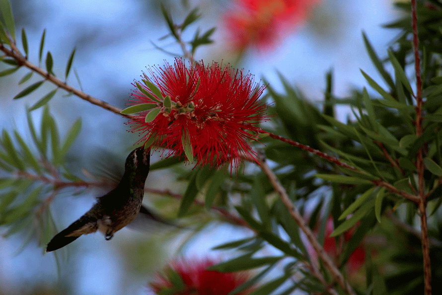
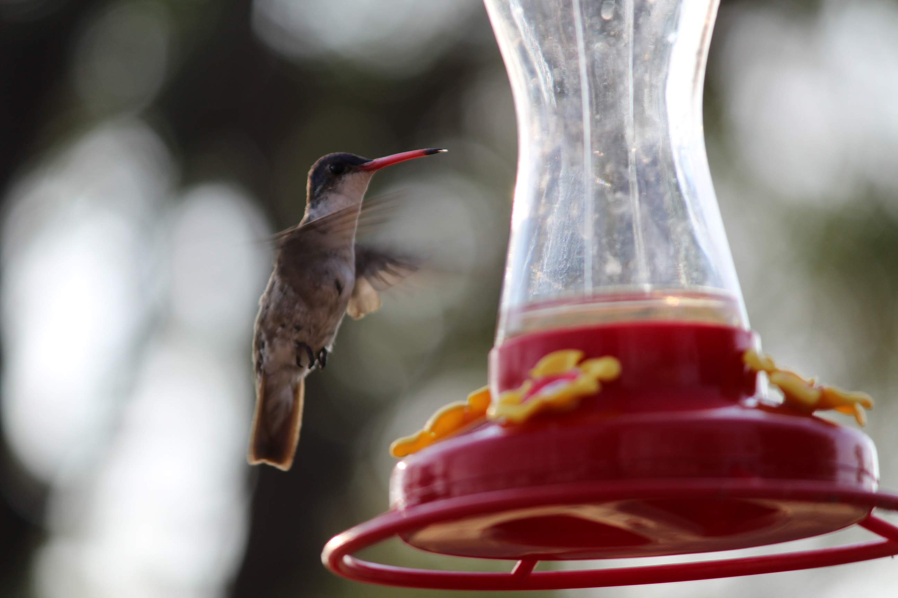
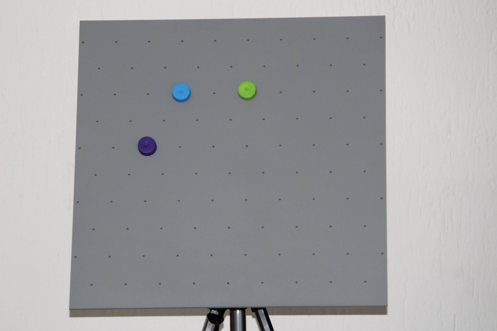
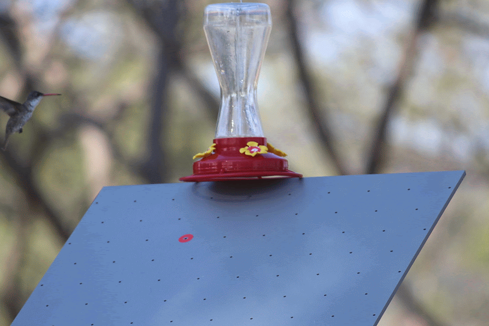
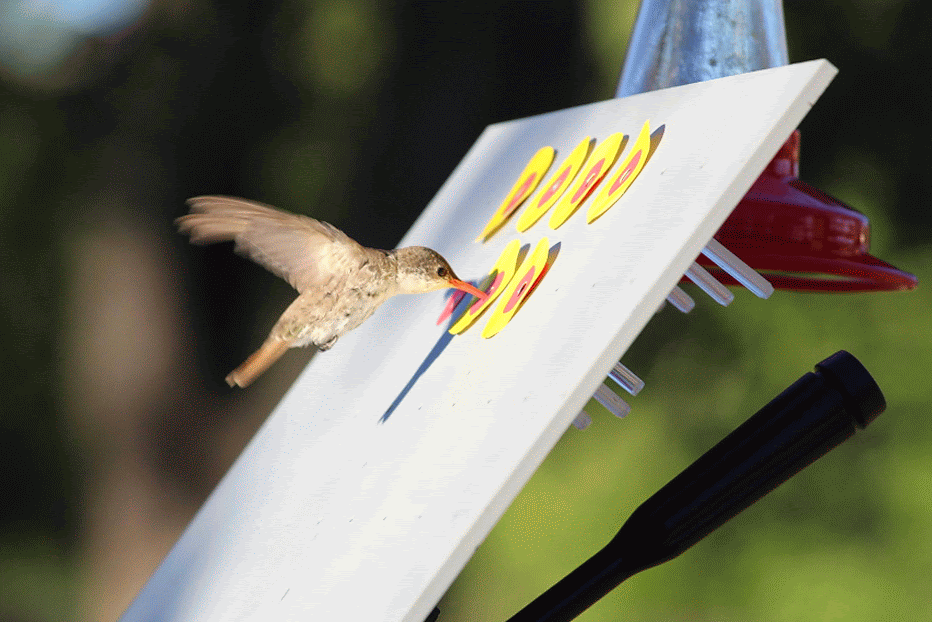

```{r, echo=FALSE, message=FALSE, warning=FALSE, include =FALSE}
library(knitr)    # For knitting document and include_graphics function
library(ggplot2)  # For plotting
library(png) 
```

```{r global_options, include=FALSE}
## This saves you from having to do this for every chunk
knitr::opts_chunk$set(echo = FALSE, 
                      warning = FALSE, 
                      message = FALSE, 
                      include = FALSE)
```

In this section, you will find a summary of the projects I'm currently working on or those that are on a hold-on status and future projects too. 

# Working Projects 

## Laboratory Research (English) 

**Rodrigo, A.** (In Progress) How density population affects the exploratory patterns of Channeled Apple Snails (_Pomacea canaliculata_) in a novel environment.


Contribution Role:  
1) Conceptualization: Formulated the research question regarding how different methods of water aeration, housing dimensions, and population density affects the exploratory patterns (i.e., distance traveled, speed, velocity, and acceleration) of Channeled Apple Snails in a novel environment.    
2) Methodology: Crossover design.    
3) Software: Tracking exploratory behaviors of snails with Walden Tracking System. Data analysis using R and R Studio.    
4) Formal Analysis: GLMM analysis.    
5) Investigation: In charge of data collection, animal care, and maintenance.  
6) Resources: Building specially designed testing conditions.  
7) Writing – original draft: Creation of reproducible published manuscript using R Markdown.  
8) Visualization: Programming and implementation of the R code to visualize and present data.  
9) Supervision: Oversight and leadership responsibility for the research activity planning and execution.  
10) Project administration: Management and coordination responsibility for the research activity planning and execution.  

{width=45%} 

## Zoo Research (English) 

Zeballos, A., Huanaco, R., Rojas, A., Hernandez, M. & **Rodrigo, A.**, (In Progress) Insight of parental care in pair-living White-tailed titi monkeys (_Plecturocebus discolor_): Allocation of daily behaviors, before and after the birth of an infant at Parque de las Leyendas Zoo (Lima, Peru).


Contribution Role:  
1) Conceptualization: Formulated the research question regarding how pair-living titi monkeys allocate their behaviors during the day, before, and after the birth of an infant.  
2) Methodology: Continuous focal sampling method, divided into 16 randomly distributed 15-minute daytime intervals across 8 hours of the day for 60 days (n = 252.75 hours of video recordings).  
3) Software: Undergraduate and zookeeper training to code behavioral data using OSS BORIS. Data analysis using R and R Studio.  
4) Formal Analysis: GLMM analysis. Investigation: Coordination of data collection and feedback to observers.  
5) Writing – original draft: Creation of a reproducible published manuscript using R Markdown.  
6) Visualization: Programming and implementation of the R code to visualize and present data.  
7) Supervision: International oversight and leadership responsibility for the research activity planning and execution.  
8) Project administration: Management and coordination responsibility for the research activity planning and execution.  

## Zoo Research (English) 

Longán, A., Gómez-Medina, C. & **Rodrigo, A.** (n.d.) Linking theory with the zoo: Evaluation of zoo animal
training programs using a novel correspondence index based on the Skinnerian three-term contingency (Stimuli-Response-Reinforcer).

Contribution Role:  
1) Conceptualization: Novel translational research design using the Skinnerian three-term contingency (Discriminative Stimuli - Operant Response - Reinforcer) to build a correspondence index to evaluate animal training programs at the zoo (Trainer Command - Animal Response - Food reward).  
2) Software: On-site data collection using Animal Behavior Pro. Data analysis using R and R Studio.  
3) Formal Analysis: GLMM analysis.  
4) Writing – original draft: Creation of a reproducible published manuscript using R Markdown.  
5) Visualization: Programming and implementation of the R code to visualize and present data.  
6) Project administration: Management and coordination responsibility for the research activity planning and execution. Partnership with the Animal Welfare Department of the Zacango Zoo.  

## Laboratory Research (English) 

**Rodrigo, A.**, Mercadillo, R., Sordo, G. & Longán, A. (n.d.) How to solve the long-term behavioral effect generated by poor environmental conditions? A model of spatial inequality in rodents.

Contribution Role:
1) Conceptualization: Formulated the research question regarding whether the expression of behavioral (i.e., free exploration in an open field) and neurobiological (i.e., synaptotagmin expression in the amygdala and hippocampus) traits of adult rats are affected by radical, rapid, sudden, and unexpected shifts in environmental configuration (e.g., changes in housing conditions) that was experienced in the earliest stages of development.  
2) Methodology: Alternating treatment design.  
3) Software: Configuration and usage of TopScan software to track rats' free movement.  
4) Formal Analysis: Adoption of OSS JASP.  
5) Resources: Building specially designed housing conditions.  
6) Writing – original draft: Reproducible published manuscript, R Markdown.  
7) Visualization: Data visualization and presentation, R.  
8) Supervision: Coordination and extraction of biological samples for analysis.  
9) Project administration: Partnership with the Area of Neurosciences of the Metropolitan Autonomous
University.  

# Paused Projects

## Fieldwork Research (English)

**Rodrigo, A.** (n.d.) How to train a hummingbird in the wild

**Step 1. Locate the hummingbird**

{width=75%}  
**Step 2. Hang an artificial feeder**

{width=75%}  
**Step 3. Prepare the apparatus**  

{width=75%}  
**Step 4. Associate the feeder with the apparatus**  

{width=75%}  
**Step 5. Cancel the access to the feeder, and let the hummingbird feed exclusively from the apparatus**  

{width=75%}  
**Step 6. Enjoy nature**

<!--Navigating 6d environments: the orientation strategies of plants. -->

<!-- elephants, talk about Gerardo (check one of his most recent lectures on teaching mahouts positive reinforcement techniques [here](https://www.facebook.com/watch/live/?ref=watch_permalink&v=1998621783603810){target="_blank"}).  -->


<!-- # Actively working on: -->

<!-- - Ph.D. Thesis, **Computation of multiple landmarks by humans: switching between strategies**    -->

<!-- (Remove until really working on this) - Preprint, **Daily Patterns of Foraging and Aggressive Behaviors in Great-tailed Grackle (_Quiscalus mexicanus_) at an Urban Patch with Availability or Absence of Resources** -->

<!-- In collaboration with the [Comparative Cognition Laboratory](http://home.cc.umanitoba.ca/~kellyd/) we are exploring how pigeons (Columba livia) prioritize information in their environment, comparing how they weigh between geometrical (angular) and featural cues.  -->
<!--add reference to tab projects-->

<!-- I'm also interested in the cognitive abilities of wild [Great Tailed-Grackles (Quiscalus mexicanus)](https://www.researchgate.net/publication/328890026_Time_Patterns_of_Foraging_Behaviors_in_Great-tailed_grackle_Quiscallus_mexicanus_at_an_Urban_Patch) and their capacity to adapt to hazardous environments, such as cities. -->