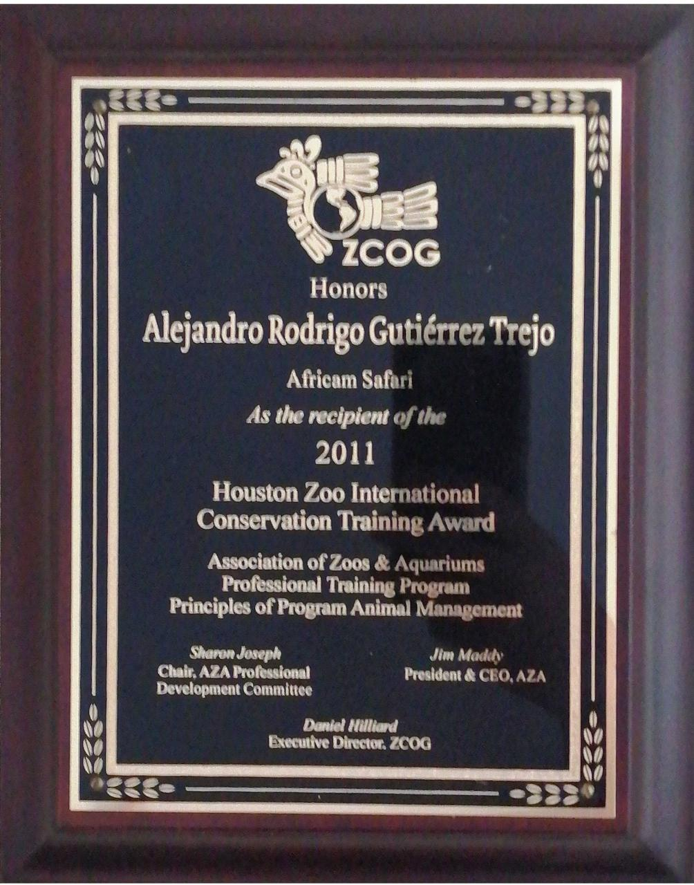

<!-- Improve research statement, remove political statements, see text at the end of the document -->

```{r URL, echo=FALSE, message=FALSE, warning=FALSE, include =FALSE}
URL_CAN <- sample(1:12, 1)
http <- "http://ae-gec.com/ARod/"
End_CAN <- "_CAN/"
EgURLCAN = paste0(http, URL_CAN, End_CAN)
```

My name is Alejandro Rodrigo, I'm a proud member of the [Learning and Comparative Cognition Laboratory](http://ceic.cucba.udg.mx/Investigacion/laboratorios?id=14) at the [Center of Behavioral Studies and Research (CEIC)](http://ceic.cucba.udg.mx/) from the [University of Guadalajara (UdG)](http://www.udg.mx/). I'm **currently finishing my Ph.D.** degree under the direction of [Dr. Jonathan Buriticá](https://scholar.google.com.mx/citations?user=GsHQSMIAAAAJ&hl=en&oi=ao) and the supervision of [Dr. Debbie M. Kelly](http://home.cc.umanitoba.ca/~kellyd/index.html). For my Ph.D., [Dr. Laurent Avila Chauvet](http://lcsia.com/CVU.html) and I developed a computer-based 2d spatial task with the aim to study **how humans select different strategies to locate a goal by computing the information of an array of visual cues placed in a half-hexagon shape** (to play the game go to `r EgURLCAN`).

Although the main goal of my thesis focuses on the spatial abilities of humans, my future goal is to continue the research in spatial cognition with different species of animals such as rats, pigeons, wild hummingbirds, and guppies. Furthermore, I want to explore novel methodologies to study and expand the knowledge on how animals navigate and orient in spaces with multiple dimensions.  

Moreover I want to continue exploring subjects of urban ecology, particularly the foraging behavior of invasive species such as wild Great-tailed grackles. The first goal is to describe the behavioral patterns of the specie and recognized what they eat, and when they eat. The second goal is to know what mechanisms these birds evolve to promote their survival in harsh environments such as cities, 


is it only because the quality or availability of the food or the absence of predators, or a mixture 

there is something else? .
A secondary goal, is to know if these evolved mechanisms are the same that help these birds to adapt so fast in a great diverse gamma of environments across the american continent.  identify if they are the top of the why they dont have predators? 

what mechanisms evolve

Describe snails line of research. 

Invasive species know if there are similarities among species, que factores promueven el desarrollo acelerado se debe exclusivamente a los depredadores? o existen similitudes? 


https://gradschool.cornell.edu/career-and-professional-development/pathways-to-success/prepare-for-your-career/take-action/research-statement/

https://careerservices.upenn.edu/search/page/4/?s=research+statement

https://careerservices.upenn.edu/application-materials-for-the-faculty-job-search/research-statements-for-faculty-job-applications/

https://careerservices.upenn.edu/grad-school-statement-of-purpose-personal-statement/

https://careerservices.upenn.edu/cover-letter-writing-guide/

https://careerservices.upenn.edu/channels/prepare-application-materials/

https://careerservices.upenn.edu/blog/2021/05/24/trying-to-find-the-right-career-and-job-for-you-use-this-hierarchy-of-needs-approach/

https://www.sciencemag.org/careers/2002/07/writing-research-plan


how they adapt and  promote the variables survive in harsh environments such as cities. what mechanisms promote their survival 


 I also want to continue exploring the life of zoo animals. Specially I want to develop a novel method to measure and evaluate the general behavioral patterns of animals, and stablish new and improved techniques of environmental enrichment and training programs, with the to measure animal welfare and evaluating programs , and fieldwork research.   

## Funding history 

During my academic development I have been awarded with several research grants from the [National Council of Science and Technology](https://www.conacyt.gob.mx/) (English for Consejo Nacional de Ciencia y Tecnología; abbreviated CONACYT). 

The first mayor grant was designated to perform my masters studies (call 290840, January 2014 to January 2016) at the CEIC under the co-direction of [Dr. Carlos Torres Ceja](https://scholar.google.es/citations?hl=es&user=StKMQD0AAAAJ&view_op=list_works&sortby=pubdate) and [Dr. Carlos Javier Flores Aguirre](https://scholar.google.es/citations?user=si0XbfIAAAAJ&hl=es&oi=ao).

```{r, echo=FALSE, out.width='100%', out.height='1000px' }
knitr::include_graphics("docs/Files/CONACyT Grants/Masters.pdf")
```

During this time I receive an additional award (Call 290936) to carry out an International Research Internship at the [Laboratory of Animal Behavior](http://www.konradlorenz.edu.co/es/estudiantes/facultades/facultad-de-psicologia/laboratorios-y-recursos-de-apoyo/953-laboratorio-de-conducta-animal.html) under the supervision of [Dr. Javier Leonardo Rico Rodriguez](https://scholar.google.es/citations?user=qQXp6Z0AAAAJ&hl=es) at the [Konrad Lorenz University Foundation](http://www.konradlorenz.edu.co/es/) (English for Fundación Universitaria Konrad Lorenz) between February and March 2015.

```{r, echo=FALSE, out.width='100%', out.height='1000px' }
knitr::include_graphics("docs/Files/CONACyT Grants/Mix_Masters.pdf")
```

The second mayor grant was given to perform my Ph.D. studies (call 291236, September 2017 to September 2020) at CEIC. 

```{r, echo=FALSE, out.width='100%', out.height='1000px' }
knitr::include_graphics("docs/Files/CONACyT Grants/PhD.pdf")
```

Once more, I earn an additional award (Call 291276) to carry out an International Research Internship at the [Comparative Cognition Laboratory](http://home.cc.umanitoba.ca/~kellyd/index.html) under the supervision of [Dr. Debbie M. Kelly](https://scholar.google.com.mx/citations?user=uDyW650AAAAJ&hl=en&oi=sra) at the [University of Manitoba](https://umanitoba.ca//) between May and November 2019.

```{r, echo=FALSE, out.width='100%', out.height='1000px' }
knitr::include_graphics("docs/Files/CONACyT Grants/Mix_PhD.pdf")
```

Back in 2011, while working as the coordinator of the animal welfare department at Africam Safari zoo, I won the Jacksonville Zoo & Gardens New World Conservation Training Award in Collaboration with the Zoo Conservation Outreach Group to attend the Principles of Program Animal Management course of the Association of Zoos and Aquariums (November 14 to 19, 2011). 

{width=50%}


# Scratch notes
<!--Add a research statement, check specifications in "applications.Rmd"-->
But why is this important? and how is this related with my research goals?
I don't blame them if they use that money to buy drugs instead of food. Imagine the horror the live everyday. A very suitable coping mechanism if you ask me. I'm not saying I approved this, but we can't judge people for something they couldn't even have the chance to choose. This and believe me, is an every-day reality in this country.  

#Informal research statement 
<!--Insert research statement -->
To understand my academic goals, personal interests and research motives, is crucial to shared with you a little part of my history and my background. 

This is not a political statement, or a story of poverty and economics. It is simply an integrated point of view that form my opinions as researcher. A history that also set-up my personality and defined who am I. This is my research statement.

I born and raised in Mexico City. A city recognized as the [most populous territory in the Western Hemisphere](https://worldpopulationreview.com/world-cities/mexico-city-population), with a calculated population for 2021 of almost 22 million people. 
The most impressive (and concerning fact) is that the total area of Mexico city is only 1,485 square kilometers (573 squared miles), which leads to a population density of 6000 people per squared kilometer (16000 residents per squared mile). Indeed, a very overcrowd city. 

Against this, Mexico is considered according to the definition of the International Monetary Fund (IMF), as a [developing country](https://www.worlddata.info/developing-countries.php) because of its lower economic performance. A performance that reflects a very alarming poverty situation, where [almost half of the total population lives below the national poverty line](https://www.imf.org/en/Countries/MEX#countrydata). 

From an ecological point of view, this could be translated to a simple but horrendous fact, half of the total population (including people of all ages) are fighting every day to have access to the most basic resource, food. The other half is probably fighting over other resources such as clean water, shelter, education, health care, and social security. This brings a scenario where competition is key to survival in literal terms.

Mexican families are aware of this. They teach us to thrive under the most excruciating situations, to be the best in this deplorable environment. The saddest result of competition other than a fragmented society is habituation. 

Every day a normal mexican walks besides a starving kid, or a young mother in despair, or a defeated father that lives in the street asking for some change. A couple of coins that could help them survive another day. A lot of people, including myself in the past, have the enough level of ignorance not only to judge them, or simply ignore their existence, but to reject them as human beings. Habituation, and lack of education is the worst adversary for my society. 

dont get me wrong, not everything is negativity, all these factors have giving us a lot of good characteristics as a society. 

https://www.macrotrends.net/cities/21853/mexico-city/population
https://worldpopulationreview.com/world-cities/mexico-city-population
https://www.worlddata.info/developing-countries.php
https://www.imf.org/en/Countries/MEX#countrydata

In our everyday lives as individuals in Mexico, the most competitive person is who gets the most resources. 

Unfortunately, due to this background, it took me several years to understand the difference between competition and collaboration. In the past I thought Mexico was one of the most collaborative countries, but I was very unaware of the actual situation. 


I consider free access to education, one of the three most valuable pillars for every individual, as long as health services and food. 


I realized of the importance of collaborating and setting the stages for progress. Although changing the situation of an entire country is not entirely in my hands, I do believe that the change comes from each of us. As I dedicate most of my grown-up live to academia, there has been  

a result of this, I'm transferring all my work to an open-access frame. I'm creating this website not only to show you my academic merits and personal interests, but to make all these resources available for everyone. In here you will find [courses]() on various topics .

For me, this country represents not only an opportunity 
And for me, the love of science comes in a form of curiosity 

So yeah, I LOVE SCIENCE, just like you! 


# Upcoming publications and projects 

A summary of the working publications, on-going experiments and on-hold Projects is 

**Working publications**

- Ph.D. Thesis & Journal article: Computation of multiple landmarks by humans: switching between strategies. 
- Book chapter: Contemporary theories and concepts in spatial cognition. 
- Journal article: Daily Patterns of Foraging and Aggressive Behaviors in Great-tailed Grackle (_Quiscalus mexicanus_) at an Urban Patch with Availability or Absence of Resources.

**On-going experiments**

- Pigeons’ Reliance on Landmark vs. Geometric Cues in a Novel Environment. 
- Behavioral patterns of a White-tailed titi (Plecturocebus discolor) couple from Parque de las Leyendas zoo (Lima, Peru)
- Density population effects on the locomotion patterns of snails.

**On-hold Projects **

- Using artificial intelligence to determine and prevent foot problems in African elephants (_Loxodonta africana_).
- The effects of the Mexican COVID-19 lockdown on the emotional and behavioral health of companion dogs: A qualitative assesment.
- Reversal of environmental conditions in adult Wistar rats.  
- Effects of environmental enrichment on the successive negative contrast operant. 
- Evaluation of Zoo Animal Training Programs

If more interested in future projects, please click [here](`r, child="projects.Rmd"`) <!--add link-->


<!-- ###################################################################### -->

<!-- This information was written for Lauren Guillette, update and check with above text -->
<!-- My name is Alejandro Rodrigo. I'm a proud member of the Learning and Comparative Cognition Laboratory in the Center of Behavioral Studies and Research (CEIC) at the University of Guadalajara (UdG). I'm currently finishing my Ph.D. degree under the direction of Dr. Jonathan Buriticá and the supervision of Dr. Debbie M. Kelly. For my Ph.D. experiment, my friend, Dr. Laurent Avila Chauvet, and I developed a computer-based 2d spatial task. The objective of the task was to study how humans select different strategies in locating a goal by computing the information of an array of visual cues placed in a half-hexagon shape. To play the game, go to http://ae-gec.com/ARod/2_CAN/. -->
<!-- Although my thesis focuses on the spatial abilities of humans, I would love to continue exploring the navigational and cognitive abilities of animals. Animals and their behavior represent a great deal in my life, and continue to amaze me every day. My previous experience includes working with a wide variety of species.  -->
<!-- In the lab, I've worked primarily with rats and pigeons. Most of the experiments I've done with rats have explored how ontogenetic factors affect performance in various cognitive tasks. Most of the results from these experiments supported the published literature in that environmental enriched rats perform better than rats in isolation or in social groups. The most exciting research I did with rats was an experiment where we reversed the housing conditions during adulthood (i.e., the enriched group goes to isolation, and vice versa).  The results showed that the behavioral response patterns of the reversed groups switched. In other words, the previously enriched, now isolated rats, behaved similarly to the first isolated group of rats. But that's not all. At the neurobiological level, the expression of synaptotagmin is not affected by the reversal of the condition. In other words, the rats from the first isolated group did not increase the production of neurotransmitters when switched to the enriched condition. The most impressive result was that rats from the first enriched group kept producing the same levels of synaptotagmin during isolation. The results suggest that the expression of the behavior is not equivalent to the expression of physiological factors when housing conditions are reversed during adulthood. Therefore, ontogenetic factors can profoundly affect both behavioral and physiological factors. How cool is that!?  -->
<!-- In line with the laboratory research, I have also had the opportunity to work with Pigeons. In collaboration with Dr. Debbie Kelly, we are currently working on a project that studies what type of information, either geometric or featural, pigeons can encode. The study also tries to understand how aging may affect the performance of these highly accurate navigators. The preliminary results have shown that the type of featural cue associated with reinforcement can affect the kind of geometric information encoded, regardless of age. However, we are still collecting data, and not much can be said about the results. Only time will tell.  -->
<!-- During these years, I have also had the chance to be involved with lab experiments that study nutcrackers and mice. Although, less can be said about those experiments, as most of the work I did was assisting the other researchers. However, since the pandemic started, and given the uncertainty of events, I decided to build my own in-home lab with aquatic snails and to study how invertebrate species learn to navigate the world. This side-project has been one of the most challenging I've ever experienced. The logistics to set the proper conditions for scarcely reported species on bibliography has taught me important lessons through trial and error. I now know that one of the greatest motivators in working with snails is spinach, even more than carrots or cucumbers. It is remarkable how they can detect food. Some informal literature said that detection occurs through smell, but I do not know that answer yet. I also know that snails forage during the night and their peak of activity is after 8 pm. Additionally, I’ve observed that calcium deficiency impacts the growth and quality of snail shells, and that the quality of the water can change abruptly without proper filtration. But the most inspiring aspect of snail research is how the complexity of environment affects exploratory behavior, just like rats. I expect to have the results from the first pilot experiment very soon. In running this pilot, I tried to evaluate how population density affects the exploratory behavior of channeled snails. Although I'm not sure if there will be differences between groups, I have learned that density may affect the shells' growth as part of the competition for resources. This variable is one that I will consider for my next series of experiments. A major benefit to having this species as an animal model is their low cost of maintenance.  -->
<!-- Continuing with the experience I've had with animals, I had the opportunity to work with wild hummingbirds and grackles in the field. Sadly, I couldn't finish my work with the hummingbirds due to a flower blooming explosion during the spring season. However, the time I spent studying hummingbirds was very insightful. The most impressive trait I observed was their ability to learn, remember, and locate goals from a single trial, tiny little birds with such remarkable survival skills.  -->
<!-- Likewise, my research with grackles has been one of the most satisfying projects, for a couple of reasons. First, all the knowledge I acquired while looking for information about these magnificent birds. Did you know that these birds have been flying the skies for around 600 years? But not only that, they are native from Mexico --- just like me --- and they now roam most of the American continent. Meaning they are excellent at adapting to a wide variety of environments. But the question is: how? How can they adapt so quickly? What strategies do they use to survive hazardous environments like cities? Even though the data we gathered could not explain for this question entirely, observing their behavior suggesteed that human waste is an excellent factor for their survival. The second reason why I loved this project is because not many researchers are interested in working with such an impressive and intelligent species, which led to an open window in exploring more aspects of their cognition. Third, and probably the creepiest, is that grackles kill and eat other species of birds. Although this fact has been widely reported, there are no records of how individual grackles cooperate in hunting other birds. Wouldn’t it be cool to be the first researcher who reports on the social strategies of hunting in grackles? (By the way, yes, there are grackles in Edmonton).    -->
<!-- Finally, much of my work with a most tremendous variety of animals happened while I was working at the zoo (Africam Safari). During this time (between my bachelors and my masters), I had the fantastic opportunity to work directly with mammals like Asian elephants, white rhinoceros, tigers, spotted hyenas, striped hyenas, giraffes, Malayan tapir, Baird's tapir, jaguars, black bears, spectacled bear, chimpanzees, bison, spider monkeys, squirrel monkeys, baboons, patas monkey, anteaters, meerkats, red kangaroos, red-necked wallabies, coatis, and kinkajou. I also had the opportunity to work with a wide variety of birds, including Mexican eagles, green and red macaws, great horned owls, barn owls, and Chattering lories. Lastly, with reptiles such as Morelet's crocodile, African spurred tortoise, red-tailed boas, Indian, Burmese, and ball pythons. Sadly, I didn't have the knowledge that I have now in testing the cognitive abilities of these species or to implement more efficient enrichment programs.  -->
<!-- Nevertheless, I'm trying to redeem such lack of insight and am currently working on several projects in collaboration with zookeepers. A project that I consider to be the most important in this area would be the training courses for zookeepers. There is a severe problem with misinformation regarding zoo animal welfare and care, all over Latin America, and it needs to stop. So, I’ve assumed a personal responsibility in teaching people how to observe, register and interpret behaviors, giving them the tools to make decisions when needed. In other words, bringing research into the zoo. From my perspective, by studying behavior dynamics in depth, we can begin asking more questions about animal needs. For example, we are presently monitoring the behavior of two White-tailed titis, a mating couple in Peru, to see what factors can affect the survival of their offspring. Another example of the work I am doing in zoo education and research is accurately detecting foot problems in African elephants using artificial intelligence (AI). Unfortuneatley, this work has come to a halt due to the second wave of COVID. -->
<!-- On a final note, these are some of the interests that occupy my life, day by day. I hope that I have transmitted to you the greatest love and passion that I have for animals and for research.  -->

